<!-- Please do not change this html logo with link -->

<a target="_blank" href="https://www.microchip.com/" id="top-of-page">
   <picture>
      <source media="(prefers-color-scheme: light)" srcset="images/mchp_logo_light.png" width="350">
      <source media="(prefers-color-scheme: dark)" srcset="images/mchp_logo_dark.png" width="350">
      
   </picture>
</a>

# LED Multiplexer — Use Case for CLB Using the PIC18F56Q35 Microcontroller With MCC Melody

This repository provides an MPLAB® X project for a Charlieplexing implementation using the Configurable Logic Block (CLB) and Timer0 (TMR0) peripherals for controlling six LEDs. Using this multiplexing technique, only three pins are needed to drive the LEDs.

The CLB peripheral is a collection of logic elements that can be programmed to perform a wide variety of digital logic functions. The logic function may be completely combinatorial, sequential, or a combination of the two, enabling users to incorporate hardware-based custom logic into their applications.


## Related Documentation

More details and code examples on the PIC18F56Q35 can be found at the following links:

- [PIC18F56Q35 Product Page](https://www.microchip.com/en-us/product/PIC18F56Q35?utm_source=GitHub&utm_medium=TextLink&utm_campaign=MCU8_PIC18-Q35&utm_content=pic18f56q35-led-multiplexer-mplab-mcc-github&utm_bu=MCU08)
- [PIC18F56Q35 Code Examples on Discover](https://mplab-discover.microchip.com/v2?dsl=PIC18F56Q35)
- [PIC18F56Q35 Code Examples on GitHub](https://github.com/microchip-pic-avr-examples/?q=PIC18F56Q35)


## Software Used

- [MPLAB® X IDE v6.30 or newer](https://www.microchip.com/en-us/tools-resources/develop/mplab-x-ide?utm_source=GitHub&utm_medium=TextLink&utm_campaign=MCU8_PIC18-Q35&utm_content=pic18f56q35-led-multiplexer-mplab-mcc-github&utm_bu=MCU08) or [MPLAB® Tools for VS Code®](https://www.microchip.com/en-us/tools-resources/develop/mplab-tools-vs-code?utm_source=GitHub&utm_medium=TextLink&utm_campaign=MCU8_PIC18-Q35&utm_content=pic18f56q35-led-multiplexer-mplab-mcc-github&utm_bu=MCU08)
- [MPLAB® XC8 v3.10 or newer](https://www.microchip.com/en-us/tools-resources/develop/mplab-xc-compilers?utm_source=GitHub&utm_medium=TextLink&utm_campaign=MCU8_PIC18-Q35&utm_content=pic18f56q35-led-multiplexer-mplab-mcc-github&utm_bu=MCU08)
- [PIC18F-Q_DFP v1.30.487 or newer](https://packs.download.microchip.com/)

## Hardware Used

- The [PIC18F56Q35 Curiosity Nano Development board](https://www.microchip.com/en-us/development-tool/EV55P36A?utm_source=GitHub&utm_medium=TextLink&utm_campaign=MCU8_PIC18-Q35&utm_content=pic18f56q35-led-multiplexer-mplab-mcc-github&utm_bu=MCU08) is used as a test platform
    <br>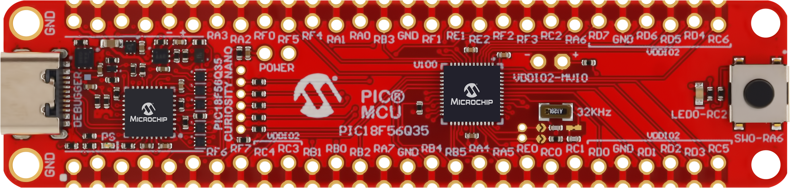

- 6 x LEDs of the same color

- 3 x 100 Ohm resistors 


## Operation

To program the Curiosity Nano board with this MPLAB X project, follow the steps provided in the [How to Program the Curiosity Nano Board](#how-to-program-the-curiosity-nano-board) chapter.<br><br>

## Concept

This example demonstrates the capabilities of the CLB, a Core Independent Peripheral (CIP) that can generate the waveforms driving the six LEDs connected in a Charlieplexing configuration.

### Schematic

The electric schematic is shown in the figure below. The LEDs have the property that they conduct current only in one direction, acting as open circuit when connected in the opposite direction. By connecting two LEDs in parallel and in oposite directions, only two pins are needed to control them one by one.
<br>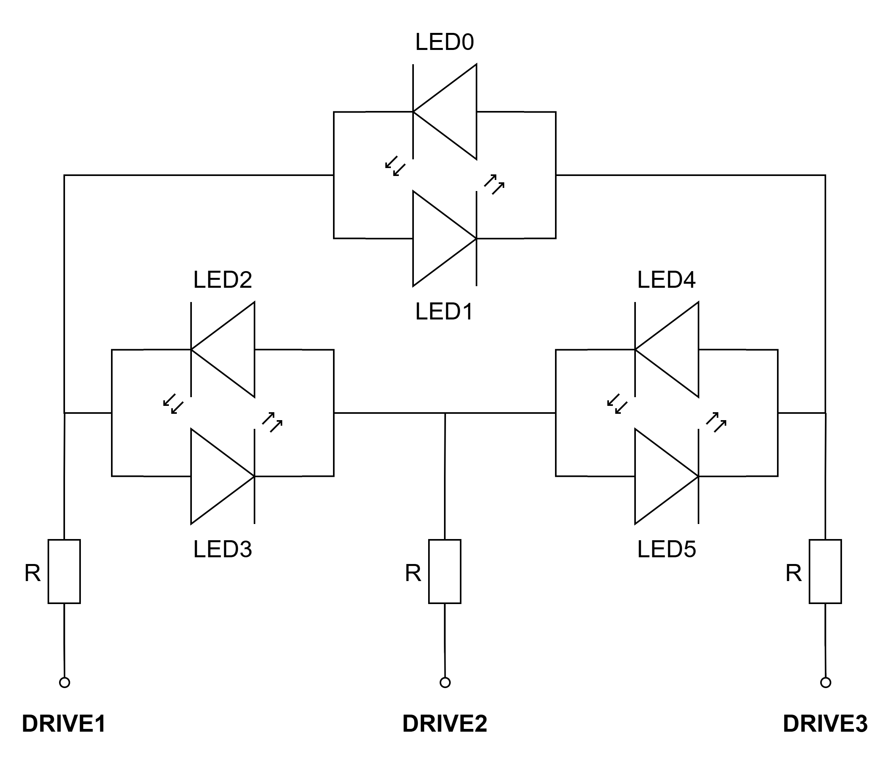

The Charlieplexing implementation assumes that only one LED is driven at a given time. To obtain that using the schematic above, two of the drive pins are used to control an LED (one pin is set as logic HIGH and the other as logic LOW) and the third one is used in tri-state, meaning that the output buffer of the pin is disabled and it has a High-Z impedance. Without using the tri-state buffer, two LEDs would be driven in any situation when trying to turn ON only one.

The following tables shows how the drive pins and the tri-state buffers of the pins must be configured to control each LED. The tri-state buffer is enabled for the DRIVE output that is not used for controlling the LED.

|          |  **DRIVE1**  |  **DRIVE2**  |  **DRIVE3**  | 
|:--------:|:------------:|:------------:|:------------:|
| **LED0** |     LOW      |      -       |     HIGH     |
| **LED1** |     HIGH     |      -       |     LOW      |
| **LED2** |     LOW      |     HIGH     |      -       |
| **LED3** |     HIGH     |     LOW      |      -       |
| **LED4** |      -       |     LOW      |     HIGH     |
| **LED5** |      -       |     HIGH     |     LOW      |

|          |**Tri-state1**|**Tri-state2**|**Tri-state3**| 
|:--------:|:------------:|:------------:|:------------:|
| **LED0** |     OFF      |     ON       |     OFF      |
| **LED1** |     OFF      |     ON       |     OFF      |
| **LED2** |     OFF      |     OFF      |     ON       |
| **LED3** |     OFF      |     OFF      |     ON       |
| **LED4** |     ON       |     OFF      |     OFF      |
| **LED5** |     ON       |     OFF      |     OFF      |

### CLB Implementation

Even if only one LED can be driven at a certain moment, it is possible to create the impression that many LEDs are driven at the same time by turning them on one by one at a sufficiently high frequency. This implementation is done in hardware using the CLB peripheral and it is shown in the figure below.
<br>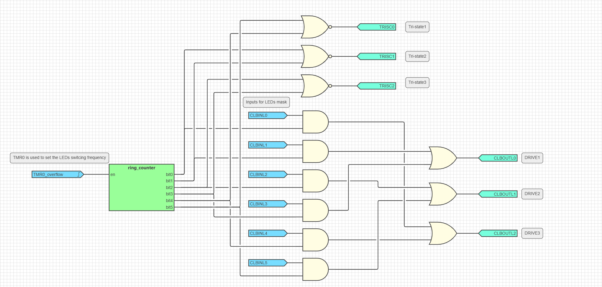

A 6-bit ring counter is used to switch between the six LEDs. The frequency at which the LED number is updated is configured using the TMR0 peripheral. For this implementation, the update frequency for all of the six LEDs is 60 Hz, resulting in a 6 × 60 = 360 Hz for the timer output frequency.

The `TRISC0-2` outputs are used to enable or disable the tri-state buffer of the driving pins (logic ‘0’ - output is disabled, logic ‘1’ - output is enabled) using the NOR gates based on the table above. Note that tri-state control using the CLB peripheral is available only on the PORTC pins on this device.

There are six software inputs used to configure the state of each LED (logic ‘0’ - OFF, logic ‘1’ - ON). For each of the six cases, only one of the drive outputs is logic ‘1’. When the state for a certain LED is selected by the ring counter by making the corresponding output high, the AND gate between the counter state and the software input of that LED verifies if the corresponding drive output has to be made logic ‘1’ (LED is ON) or if it remains logic ‘0’ (LED is OFF). After all six LEDs are verified, the counter is reset and the process is resumed. The `CLBINL0-5` outputs are used for configuring the LEDs to allow the usage of the `CLB1_SWIN_Write8()` function to write the mask of the LEDs in software.

The following masks are defined in the main program to control the LEDs. The user can simply use these masks and the `WRITE_LEDS(leds)` macro define to modify the state of the LEDs.
```
#define LEDS_OFF    (0x00)
#define LED0        (0x01 << 0)
#define LED1        (0x01 << 1)
#define LED2        (0x01 << 2)
#define LED3        (0x01 << 3)
#define LED4        (0x01 << 4)
#define LED5        (0x01 << 5)

#define WRITE_LEDS(leds)  do { CLB1_SWIN_Write8(leds); }  while(0)
```

Some predefined LED patterns are created in the example program and called sequentially in the main loop with a 500 ms delay to demonstrate the functionality. For example, the following pattern is used to turn ON the LEDs one by one.
```
const uint8_t ledPattern1[13] = {LEDS_OFF, LED0, LED1, LED2, LED3, LED4, LED5, LED4, LED3, LED2, LED1, LED0, LEDS_OFF};
```

<br>

## Setup 

The following peripheral and clock configurations are set up using MPLAB Code Configurator (MCC) Melody for the PIC18F56Q35:

1. Configurations Bits:
    - CONFIG1:
        - External Oscillator Selection: Oscillator not enabled
        <br>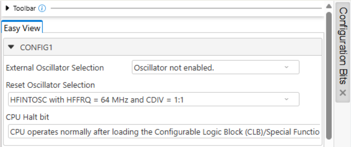
    - CONFIG3:
        - Brown-out Reset Enable bits: Brown-out Reset disabled
        <br>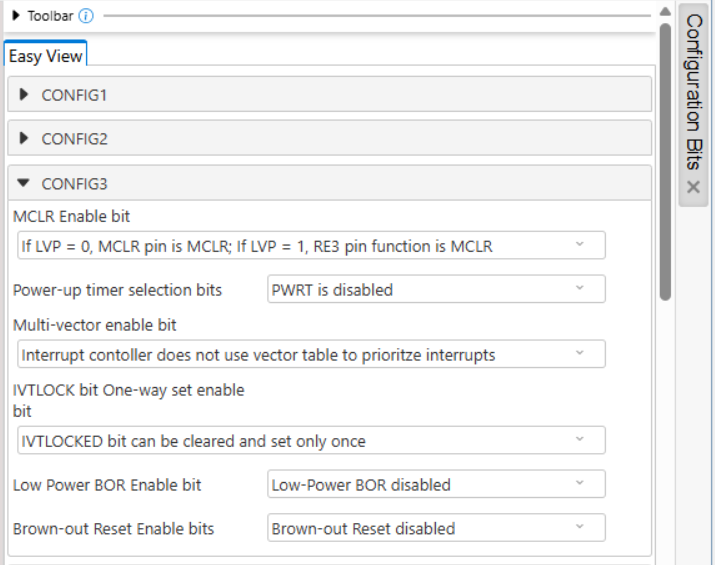
    - CONFIG5:
        - WDT operating mode: WDT Disabled; SEN is ignored
        <br>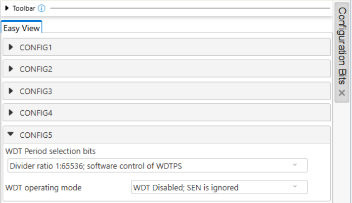

2. Clock Control:
    - Clock Source: HFINTOSC
    - HF Internal Clock: 32_MHz
    - Clock Divider: 1
    <br>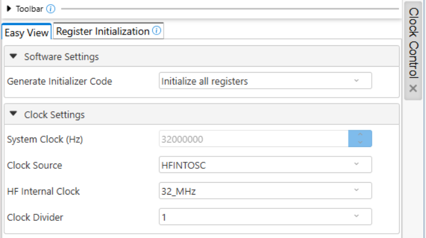

3. CLB Synthesizer Library:
    - Clock Divider: 1
    - Clock Selection: HFINTOSC
    <br>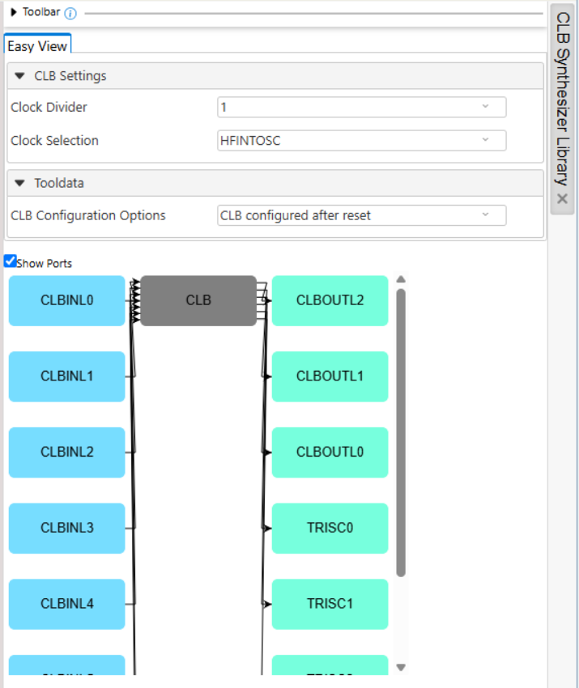 

4. CLB1:
    - Enable CLB: Enabled
    <br>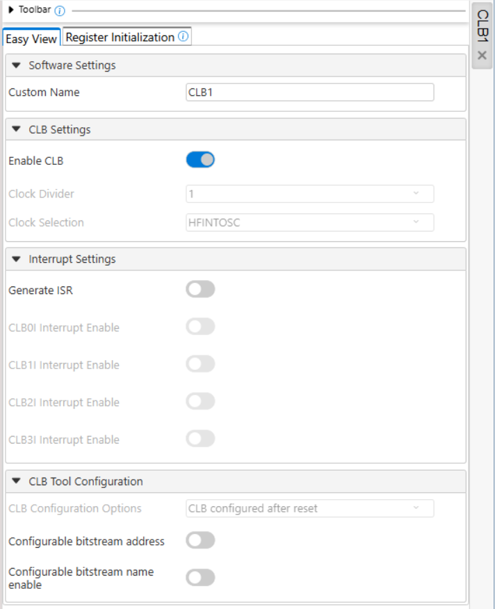 

5. TMR0:
    - Timer Enable: Enabled
    - Timer Mode: 8-bit
    - Clock Source: HFINTOSC
    - Prescaler: 1:512
    - Requested Period: 2.77 ms
    <br>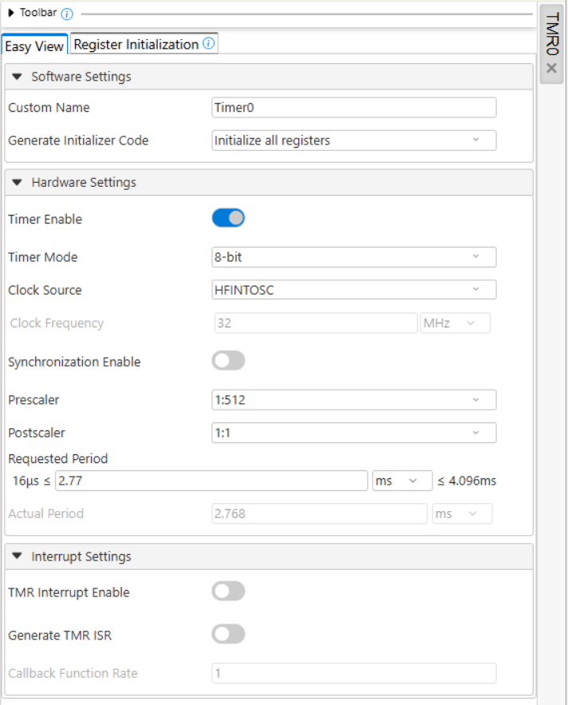  

6. CRC:
    - Auto-configured by the CLB

7. Pin Grid View:
    - CLBPPSOUT0: RC0 (Drive 1)
    - CLBPPSOUT1: RC1 (Drive 2)
    - CLBPPSOUT2: RC2 (Drive 3)
    <br>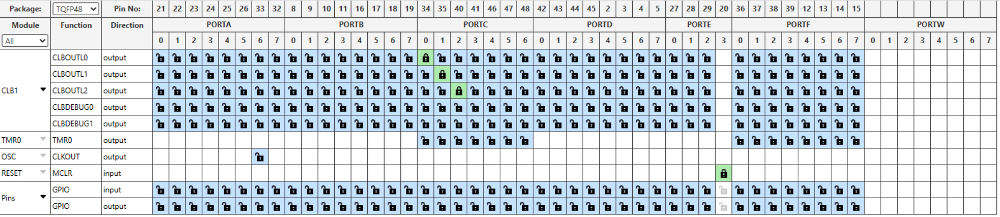 

<br>

## Demo

The demo below shows how the patterns created in the main program control the six LEDs.
<br> 

**Note:** This gif is played at 2x speed.
<br>

## Summary

This example demonstrates the capabilities of the CLB, a CIP that can generate the waveforms controlling six LEDs connected in a Charlieplexing configuration.
<br>

##  How to Program the Curiosity Nano Board

This chapter demonstrates how to use the MPLAB X IDE to program a PIC® device with an `Example_Project.X`. This is applicable to other projects.

1.  Connect the board to the PC.

2.  Open the `Example_Project.X` project in MPLAB X IDE.

3.  Set the `Example_Project.X` project as main project.
    <br>Right click the project in the **Projects** tab and click Set as Main Project.
    <br>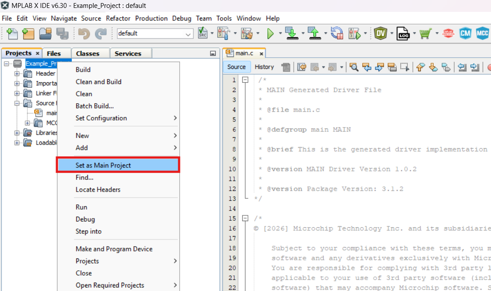

4.  Clean and build the `Example_Project.X` project.
    <br>Right click the `Example_Project.X` project and select Clean and Build.
    <br>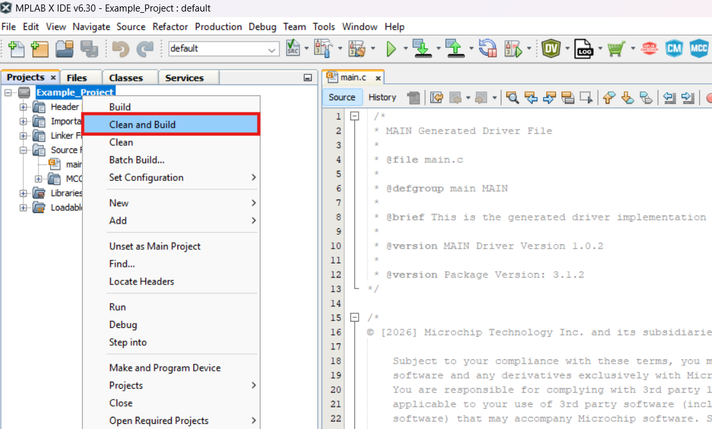

5.  Select PICxxxxx Curiosity Nano in the Connected Hardware Tool section of the project settings:
    <br>Right click the project and click Properties.
    <br>Click the arrow under the Connected Hardware Tool.
    <br>Select PICxxxxx Curiosity Nano (click the SN), click **Apply** and then click **OK**:
    <br>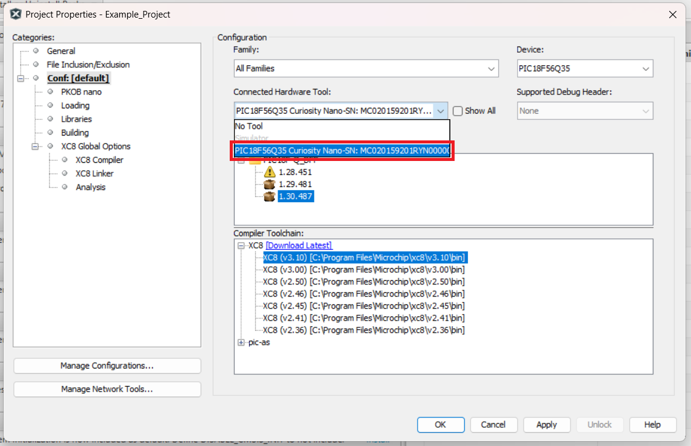

6.  Program the project to the board.
    <br>Right click the project and click Make and Program Device or directly press the specific button.
    <br>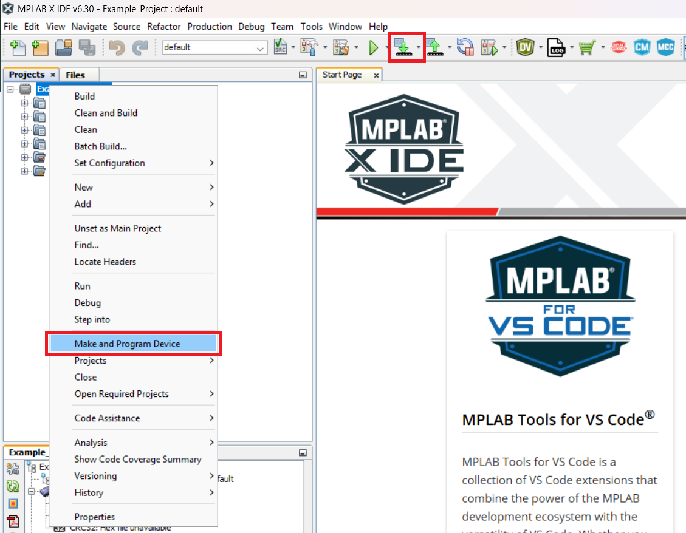

<br>

- - - 
## Menu
- [Back to Top](#led-multiplexer--use-case-for-clb-using-the-pic18f56q35-microcontroller-with-mcc-melody)
- [Back to Related Documentation](#related-documentation)
- [Back to Software Used](#software-used)
- [Back to Hardware Used](#hardware-used)
- [Back to Operation](#operation)
- [Back to Concept](#concept)
- [Back to Setup](#setup)
- [Back to Demo](#demo)
- [Back to Summary](#summary)
- [Back to How to Program the Curiosity Nano Board](#how-to-program-the-curiosity-nano-board)